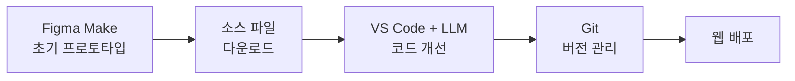

# AusRealTour

> 호주 실거주 경험을 가진 로컬 가이드와 여행자를 연결하는 투어 예약 매칭 서비스

AusRealTour는 유학, 워킹홀리데이, 장기 거주 등 호주에서 직접 살아본 가이드가 여행자의 일정과 취향에 맞는 로컬 투어를 제공하도록 기획한 웹 서비스입니다.

일반적인 패키지여행에서 접하기 어려운 현지인의 장소와 경험을 전달하고, 여행자는 검증된 가이드의 투어를 탐색하고 상담·예약할 수 있습니다.

## Project Overview

- 프로젝트 유형: 개인 웹 서비스 기획 및 UI 구현
- 주요 사용자: 호주 자유여행을 준비하는 한국인 여행자
- 핵심 가치: 실거주 경험, 검증된 가이드, 한국어 소통, 간편한 투어 탐색
- 주요 기능: 투어 탐색, 조건별 필터링, 투어 상세 정보, 상담 신청, 예약 조회, 가이드 지원

## Production Workflow

이 프로젝트는 생성형 AI를 단순 결과물 제작 도구로 사용하는 데 그치지 않고, 작업 단계에 따라 적합한 도구를 나누어 활용하는 방식으로 제작했습니다.

1. **Figma Make로 초기 프로토타입 제작**
   - 서비스 구조와 주요 화면을 빠르게 시각화했습니다.
   - 반복적인 프롬프트 작업을 통해 레이아웃과 사용자 흐름을 구체화했습니다.

2. **프로젝트 소스 파일 다운로드**
   - Figma Make의 토큰 사용량을 효율적으로 관리하기 위해 초기 구현이 완료된 시점에 전체 소스 파일을 내려받았습니다.
   - 이후 작업 환경을 VS Code로 전환했습니다.

3. **LLM을 활용한 코드 편집 및 고도화**
   - 다운로드한 React 코드를 LLM과 함께 분석하고 직접 수정했습니다.
   - 반응형 레이아웃, 컴포넌트 구조, 타이포그래피, 콘텐츠 너비, 디자인 토큰 및 유지보수성을 개선했습니다.
   - 변경할 파일과 코드를 검토하며 필요한 부분만 선택적으로 반영했습니다.

4. **Git 기반 버전 관리 및 배포**
   - 수정 내역을 Git으로 관리했습니다.
   - 완성된 프로젝트를 원격 저장소에 반영하고 웹 환경에 배포했습니다.



이 과정을 통해 Figma Make의 토큰에만 의존하지 않고, 초기 제작 속도는 유지하면서도 이후 코드를 직접 소유·수정하고 재사용할 수 있는 워크플로를 구축했습니다.

## Key Features

### 투어 탐색

- 지역 및 테마별 투어 필터링
- 인기 투어와 로컬 가이드 정보 제공
- 투어별 가격, 소요 시간, 후기 및 상세 일정 확인

### 상담 및 예약

- 관심 투어 선택 후 상담 신청
- 개인정보 및 마케팅 수신 동의 처리
- 예약번호를 이용한 예약 내역 조회

### 로컬 가이드

- 실거주 경험을 중심으로 한 서비스 차별점 소개
- 가이드 검증 과정과 환불 정책 안내
- 신규 로컬 가이드 지원 폼 제공

### 사용자 경험

- 데스크톱·태블릿·모바일 반응형 UI
- 모바일 내비게이션
- AI 상담 모달
- 슬라이드형 히어로 이미지
- 페이지별 SEO 메타데이터

## Tech Stack

| 구분 | 사용 기술 |
|---|---|
| Design & Prototyping | Figma, Figma Make |
| Frontend | React 19, TypeScript |
| Routing | React Router 8 |
| Styling | Tailwind CSS 4 |
| Build Tool | Vite 8 |
| Development | VS Code, LLM-assisted coding |
| Version Control | Git |

## Design System

Tailwind CSS v4의 `@theme`을 활용해 색상, 폰트, 콘텐츠 너비, 모서리 및 그림자를 디자인 토큰으로 관리합니다.

```text
src/
└── styles/
    └── theme.css
```

대표 토큰은 다음과 같습니다.

```css
--color-navy: #1B2D4F;
--color-terracotta: #C4603A;
--color-sand: #F5EFE6;
--color-cream: #FDFAF6;

--font-display: 'Fraunces', Georgia, serif;
--font-body: 'Pretendard', system-ui, sans-serif;

--container-content: 72rem;
--container-reading: 48rem;
```

컴포넌트에서는 직접적인 색상값 대신 의미가 있는 공유 클래스를 사용할 수 있습니다.

```tsx
<section className="bg-navy text-cream">
  <div className="w-full max-w-content mx-auto px-4 sm:px-6 lg:px-8">
    <h2 className="font-display text-terracotta-light">
      로컬이 안내하는 진짜 호주 여행
    </h2>
  </div>
</section>
```

이 구조는 새로운 화면을 추가하거나 후임 작업자에게 프로젝트를 인계할 때 동일한 디자인 기준을 재사용하기 위한 것입니다.

## Project Structure

```text
src/
├── components/        # 공통 레이아웃 및 UI 컴포넌트
├── data/              # 투어 데이터
├── imports/           # 이미지 및 SVG 리소스
├── lib/               # SEO 등 공통 로직
├── pages/             # 라우트별 페이지
├── styles/            # 디자인 토큰
├── App.tsx             # 애플리케이션 진입 컴포넌트
├── index.css           # 전역 스타일
├── main.tsx            # React 마운트
└── routes.ts           # 라우팅 설정
```

## Getting Started

### 1. 프로젝트 설치

```bash
npm install
```

### 2. 개발 서버 실행

```bash
npm run dev
```

### 3. 프로덕션 빌드

```bash
npm run build
```

### 4. 빌드 결과 미리보기

```bash
npm run preview
```

## What I Learned

- 생성형 AI로 만든 초기 결과물을 실제 개발 환경으로 이전하고 관리하는 방법
- Figma Make, VS Code, LLM을 단계별로 조합하는 효율적인 제작 과정
- React 컴포넌트와 라우트 기반의 멀티페이지 서비스 구조
- Tailwind CSS v4 디자인 토큰을 활용한 일관된 UI 관리
- 반응형 레이아웃과 재사용 가능한 콘텐츠 컨테이너 설계
- Git을 활용한 변경 이력 관리 및 배포 과정

## Future Improvements

- 실제 회원가입 및 로그인 기능 연동
- 투어 예약·결제 API 연동
- 상담 신청 데이터베이스 저장
- 사용자 및 가이드용 대시보드 구현
- 실제 후기 데이터 및 관리자 기능 연동

---

© 2026 AusRealTour. All rights reserved.
